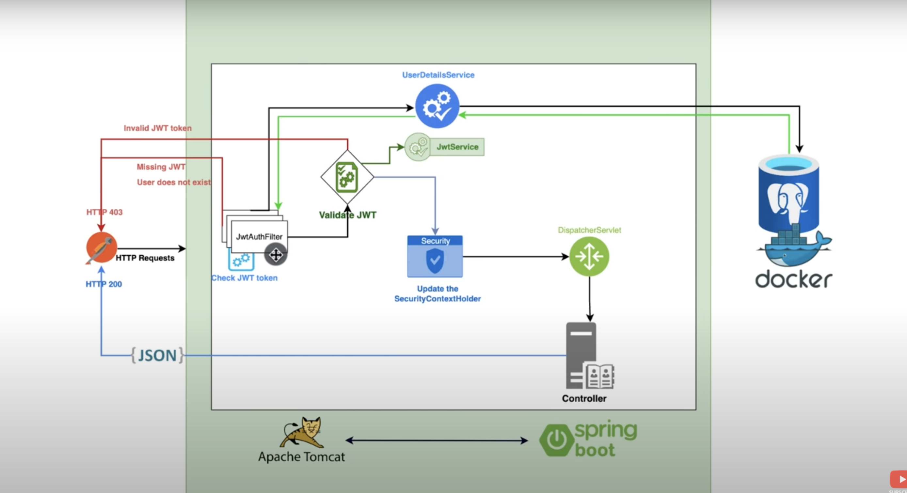

# Spring Security JWT
Implementing a JWT using Spring Security
## JWT Steps
- Step 1: I have changed the type of the `application.propreties` to yml and I have connect to my database using the url in the [application.yml](src/main/resources/application.yml)
- Step 2: I have created the [user](src/main/java/com/springsecurityjwt/user) package and the [User](src/main/java/com/springsecurityjwt/user/User.java) class
- Step 3: I added all the required annotations to [User](src/main/java/com/springsecurityjwt/user/User.java) with the help of the **lombook** Dependency.
- Step 4: I have run my Spring app to test if the User table will be created in the database
- Step 5: I have implemented The **UserDetails** interface and I have created a [Role](src/main/java/com/springsecurityjwt/user/Role.java) Enum
- Step 6: I have created a repository [UserRepository](src/main/java/com/springsecurityjwt/user/UserRepository.java) that extends **JpaRepository**
- Step 7: I have created a [config](src/main/java/com/springsecurityjwt/config) package and I have created [JwtAuthenticationFilter](src/main/java/com/springsecurityjwt/config/JwtAuthenticationFilter.java) class
- Step 8: I have created a [JwtService](src/main/java/com/springsecurityjwt/config/JwtService.java) class
- Step 9: I have created a constant called `SECRET_KEY` that will hold the key value
- Step 10: I have generated an aes encryption key with the size 256 with this command
```
openssl rand -hex 32
```
- Step 11: I have assigned it to `SECRET_KEY`
- Step 12: I have created [ApplicationConfig](src/main/java/com/springsecurityjwt/config/ApplicationConfig.java) class that contains the `UserDetailsService`
- Step 13: I have created [SecurityConfiguration](src/main/java/com/springsecurityjwt/config/SecurityConfiguration.java) class in the config
- Step 14: I have created [auth](src/main/java/com/springsecurityjwt/auth) package and [AuthenticationController](src/main/java/com/springsecurityjwt/auth/AuthenticationController.java) class
- Step 15: I have created [AuthenticationRequest](src/main/java/com/springsecurityjwt/auth/AuthenticationRequest.java) class
- Step 16: I have created [AuthenticationResponse](src/main/java/com/springsecurityjwt/auth/AuthenticationResponse.java) class
- Step 17: I have created [RegisterRequest](src/main/java/com/springsecurityjwt/auth/RegisterRequest.java) class
- Step 18: I have created [AuthenticationService](src/main/java/com/springsecurityjwt/auth/AuthenticationService.java) class
- Step 19: I have created [demo](src/main/java/com/springsecurityjwt/demo) package and [DemoController](src/main/java/com/springsecurityjwt/demo/DemoController.java) class that expose an Api Endpoint to test the JWT Authentication To **Test Authenticated Request**

# JWT (JSON Web Token)
## How it works ?

## Spring Boot Signup & Login with JWT Authentication Flow
The diagram shows flow of how we implement User Registration, User Login and Authorization process.<br>
<br>
A legal JWT must be added to HTTP Authorization Header if Client accesses protected resources.<br>
You will need to implement Refresh Token:<br>

## Spring Boot Server Architecture with Spring Security
You can have an overview of our Spring Boot Server with the diagram below:<br>

## References for this JWT Implementation
- [Amigoscode JWT Authentication and Authorisation](https://youtu.be/KxqlJblhzfI?si=lVoDYf_5_kJFGBi9) 
- [Github Repo for the tuto](https://github.com/ali-bouali/spring-boot-3-jwt-security)<br>
