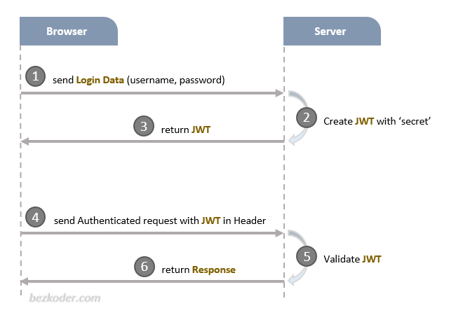
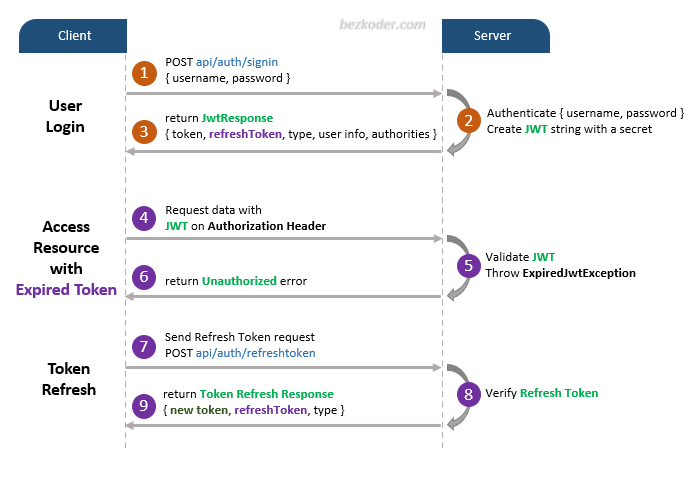

# Spring Security JWT
Implementing a JWT using Spring Security
## JWT Steps
- Step 1: I have changed the type of the `application.propreties` to yml and I have connect to my database using the url in the [application.yml](src/main/resources/application.yml)
- Step 2: I have created the [user](src/main/java/com/springsecurityjwt/user) package and the [User](src/main/java/com/springsecurityjwt/user/User.java) class
- Step 3: I added all the required annotations to [User](src/main/java/com/springsecurityjwt/user/User.java) with the help of the **lombook** Dependency.
- Step 4: I have run my Spring app to test if the User table will be created in the database
- Step 5: I have implemented The **UserDetails** interface and I have created a [Role](src/main/java/com/springsecurityjwt/user/Role.java) Enum

# JWT (JSON Web Token)
## How it works ?

## Spring Boot Signup & Login with JWT Authentication Flow
The diagram shows flow of how we implement User Registration, User Login and Authorization process. 
 
A legal JWT must be added to HTTP Authorization Header if Client accesses protected resources. 
You will need to implement Refresh Token: 

## Spring Boot Server Architecture with Spring Security
You can have an overview of our Spring Boot Server with the diagram below: 

